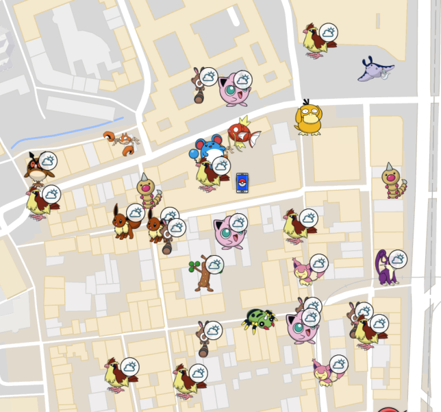

.. RM-Alt documentation master file, created by
   sphinx-quickstart on Tue Mar 27 10:49:46 2018.
   You can adapt this file completely to your liking, but it should at least
   contain the root `toctree` directive.

Welcome to RM-Alt's documentation!
==================================
RM-Alt uses a lot of `Rocket Map`_ code but has many additional features such as: auto-removing accounts with shadow bans,
IV scanning enhancements, scanning for Ditto and Discord Authentication to name a few enhancements.

The setting up and installing of RM-Alt is a little different to Rocket Map.  These docs will help explain exactly what
is needed to get RM-Alt running.

[ `Official GitHub`_ ] [ `GitHub Issues`_ ]

.. toctree::
   :maxdepth: 2
   :caption: Table of Contents:

   Install Prerequisite 1 - PGPool <install-pgpool>
   Install Prerequisite 2 - PGScout <install-pgscout>
   Install RM-Alt <install-rm-alt>

.. toctree::
   :maxdepth: 2
   :caption: Extras

   Supervisord <extras/supervisord>

.. _Rocket Map: https://rocketmap.readthedocs.io/en/develop/
.. _Official GitHub: https://github.com/SenorKarlos/RocketMap
.. _GitHub Issues: https://github.com/SenorKarlos/RocketMap/issues
